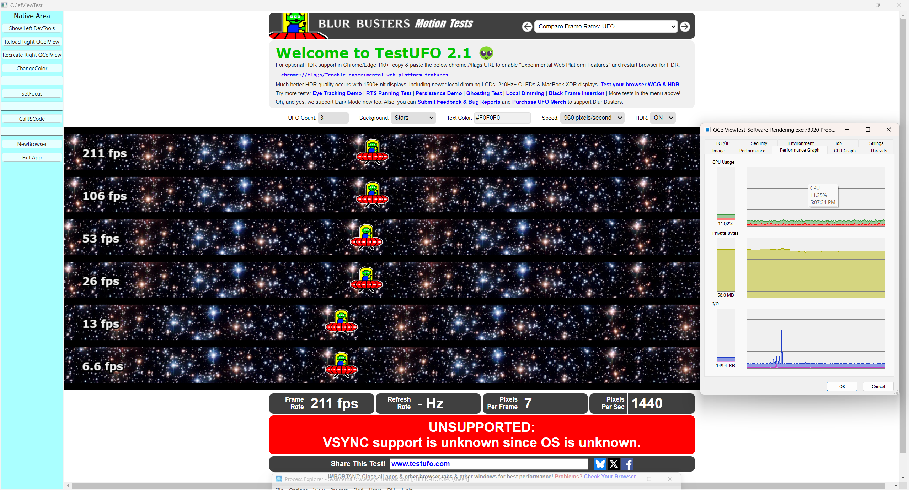
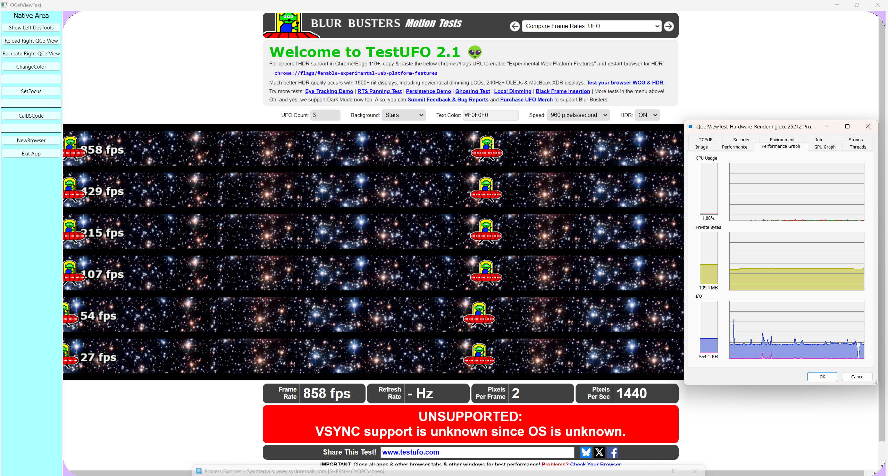
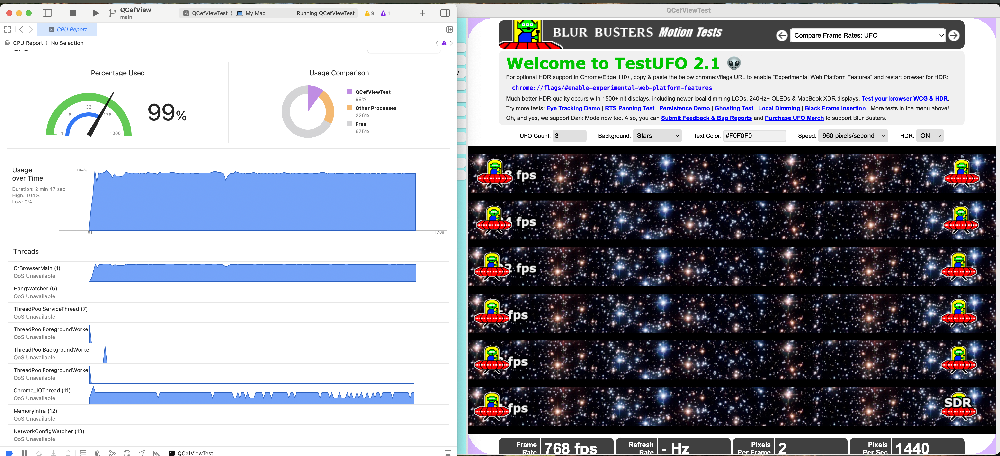
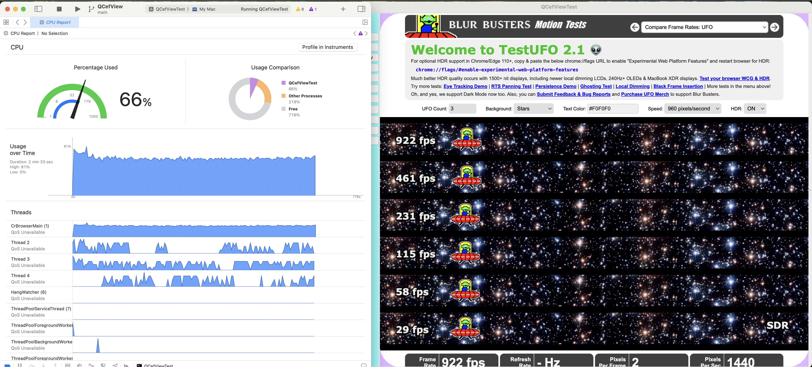

# QCefView

## Introduction

QCefView is a Qt-based QWidget that encapsulates CEF (Chromium Embedded Framework). With QCefView, you can build your application UI using modern frontend development techniques, boosting project efficiency while keeping UI and business logic decoupled. Most importantly, QCefView enables seamless CEF integration within Qt applications.

### Build Status
| Platform |  Lastest Build Status  | OSR Production Ready  | NCW Production Ready  |
|---|---|---|---|
| Windows-x86_64 | [](https://github.com/CefView/QCefView/actions/workflows/build-windows-x86_64.yml) | :heavy_check_mark: | :heavy_check_mark: |
| macOS-x86_64 | [](https://github.com/CefView/QCefView/actions/workflows/build-macos-x86_64.yml)          | :heavy_check_mark: | :heavy_check_mark: |
| Linux-x86_64 | [](https://github.com/CefView/QCefView/actions/workflows/build-linux-x86_64.yml)         | :heavy_check_mark: | :x: |

+ **OSR** = Offscreen Rendering Mode  
+ **NCW** = Native Child Window Mode  

### Feature Status
| Platform  | NCW<br> CEF All Versions | OSR - Software Rendering<br> CEF All Versions | OSR - Hardware Rendering<br> CEF 125+ |
|---|:---:|:---:|:---:|
|Windows | :heavy_check_mark: | :heavy_check_mark: | :heavy_check_mark: (DirectX 11) |
|MacOS   | :heavy_check_mark: | :heavy_check_mark: | :heavy_check_mark: (Metal)  |
|Linux   | :heavy_check_mark: | :heavy_check_mark: | :x: WIP (OpenGL) |

**WIP (Work In Progress)**: Features under development, no guaranteed release date.

---

## Quick Start

### Clone the Project

```sh
git clone https://github.com/CefView/QCefView.git
```

The dependency on `CefViewCore` has been converted to **CMake FetchContent**, meaning submodules are no longer required. Refer to: `cmake/CefViewCoreConfig.cmake` for more details.

### Documentation

Find the latest documentation here:

- 📖 [English Documentation](https://cefview.github.io/QCefView/)
- 📖 [中文文档](https://cefview.github.io/QCefView/zh/)

These resources will help you quickly understand and integrate QCefView into your projects.

---

## OSR Mode & Hardware Acceleration

QCefView supports **CEF offscreen rendering mode (OSR)**, which is **enabled by default**. To disable OSR mode, set `setWindowlessRenderingEnabled` to `false` in the configuration:

```cpp
QCefConfig config;

// OSR (Windowless Rendering) is enabled by default
// Set to false to disable OSR mode
config.setWindowlessRenderingEnabled(false);
```

### Enabling Hardware Acceleration (CEF 125+)

Starting from CEF 125+, GPU resource sharing is generally available. QCefView now supports **hardware acceleration** for OSR mode. To enable it:

```cpp
QCefSetting setting;

// Enable hardware renderer (only applicable in OSR mode)
setting.setHardwareAcceleration(true);

// Set frame rate limit
setting.setWindowlessFrameRate(240);

// Create the QCefView widget
auto qCefViewWidget = new QCefView("https://www.testufo.com/", &setting);
```

### Windows Benchmark

#### QCefViewTest-Windows-Software-Rendering-FPS1000-Limit

- Average FPS: 200 
- Average CPU: 10%




#### QCefViewTest-Windows-Hardware-Rendering-FPS1000-Limit

- Average FPS: 900
- Average CPU: 1%




### macOS Benchmark

#### QCefViewTest-macOS-Software-Rendering-FPS1000-Limit

- Average FPS: 750
- Average CPU: 100% (Total 1000%)



#### QCefViewTest-macOS-Hardware-Rendering-FPS1000-Limit

- Average FPS: 930
- Average CPU: 60% (Total 1000%)



---

## Contributing

We welcome contributions and suggestions! To maintain consistency, please ensure your code adheres to the style defined in `.clang-format`.

### How You Can Contribute

- 📌 Solve an **issue** (e.g., answer a question in the Issues section or Gitter chat)
- 🛠 Fix a **bug** or report one
- 📖 Improve **documentation** (even fixing typos helps!)

If you're interested in becoming a QCefView **maintainer** (e.g., merging PRs, triaging issues), please contact me via email: `sheentianshen#gmail.com`. I'm happy to help set the right permissions for you.

---

💡 **Let's build a better QCefView together!** 🚀

