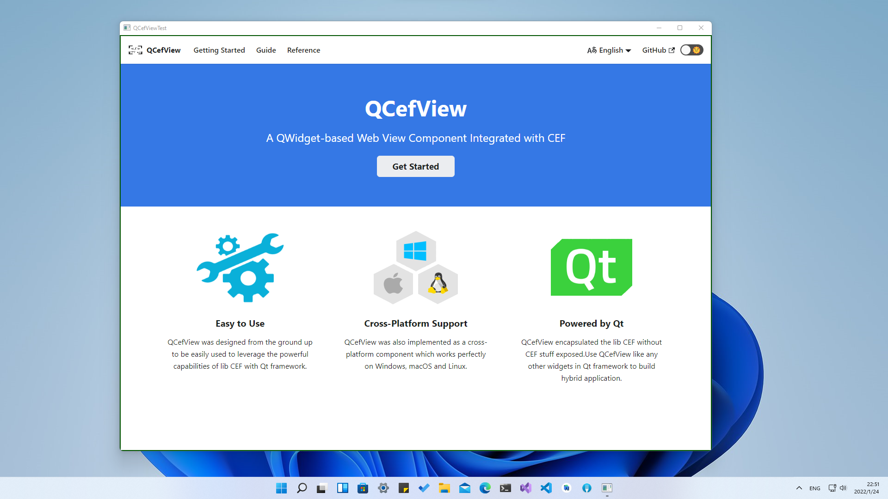
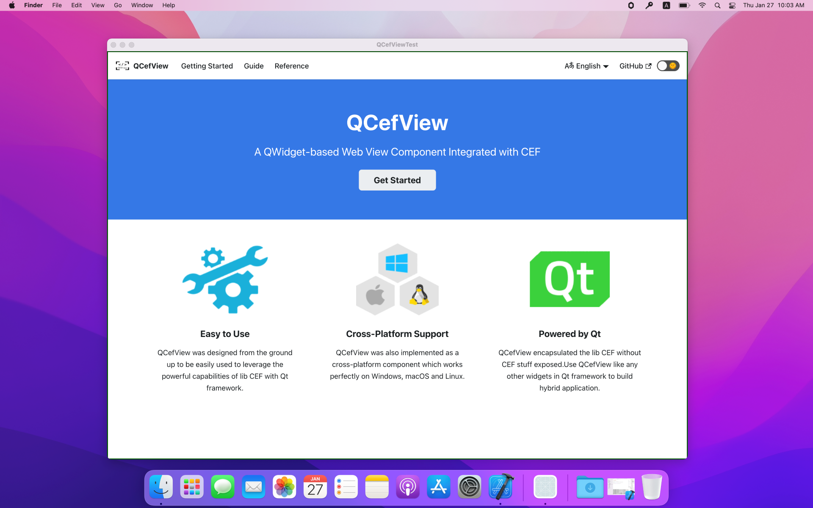
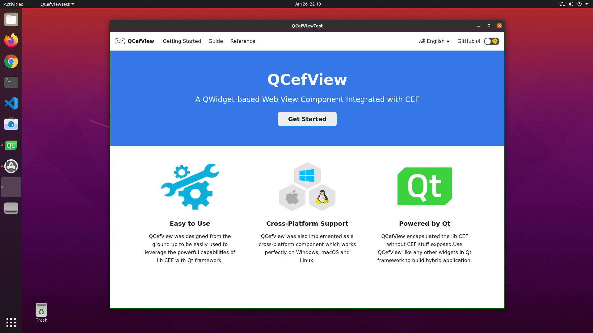

# Introduction
[TOC]

## What is QCefView?

QCefView is a powerful Qt Widget that seamlessly integrates the [Chromium Embedded Framework](https://github.com/chromiumembedded/cef). It empowers you to build applications leveraging CEF's robust capabilities within the familiar Qt ecosystem.

With QCefView, you can:

-   Develop applications using familiar Qt forms, signals, and slots.
-   Achieve straightforward interoperability between Web (JavaScript) and Native (C++) components.

| Windows | macOS | Linux |
:--------:|:-----:|:------|
||||

## Why Choose QCefView over Electron?

QCefView and Electron serve different purposes and cater to distinct development styles. Here's a comparison:

| Feature          | QCefView                                                                 | Electron                                                                   |
| ---------------- | ------------------------------------------------------------------------ | -------------------------------------------------------------------------- |
| Scope            | Qt UI Component                                                          | Comprehensive Application Framework                                        |
| Target Audience  | Native (C++) developers                                                  | Frontend developers                                                        |
| Primary Language | C++                                                                      | JavaScript                                                                 |
| Interoperability | Direct, straightforward Web/Native communication                         | Requires plugins for Native integration                                      |
| Use Case         | Embedding web UI within a native application                             | Building cross-platform desktop applications primarily with web technologies |

In essence:

-   **QCefView** is a component within the Qt framework, ideal for enhancing native applications with web-based UI elements.
-   **Electron** is a complete framework for building cross-platform desktop applications using web technologies.

## Ideal Use Cases for QCefView

QCefView excels in scenarios where you want to combine the power of web frontend technologies for the UI with the performance and control of native languages for core functionality.

Consider QCefView for applications like:

-   **Multimedia Players:** Leverage web technologies for rich, dynamic user interfaces.
-   **Game Platforms/Launchers:** Create visually appealing and interactive frontends for native game engines.
-   **Utility Applications:** Build feature-rich tools with complex UIs that benefit from web-based rendering.
-   **Custom Embedded Browsers (with limitations):** Embed web content with a high degree of control over the rendering process.

In these context-driven applications, web frontend technologies are excellent for displaying lists, tables, and complex pages with engaging effects. QCefView acts as a WebApp container, allowing you to host your web UI while retaining your hard-core business logic as native components. The interoperability provided by QCefView seamlessly bridges the gap between the web and native worlds.

> [!note]
> If your primary goal is to develop a full-fledged web browser application, QCefView might not be the optimal choice. QCefView is designed as a UI component and intentionally disables certain browser-specific features. For building a complete browser, consider using the original CEF library directly.

## Alternatives to Qt

### Unreal Game Development
For Unreal Engine based game developers, you may want to try [UCefView](https://cefview.github.io/UCefView) plugin. This is a powerful stable and flexible WebView component designed for Unreal Engine.

### macOS App Development
If you prefer not to use Qt, you can still leverage CEF by integrating it with other frameworks. For example, you can integrate CEF with the Cocoa framework, as demonstrated in the [CocoaCefView](https://github.com/CefView/CocoaCefView) project. This allows you to create custom CEF views tailored to your specific needs.
